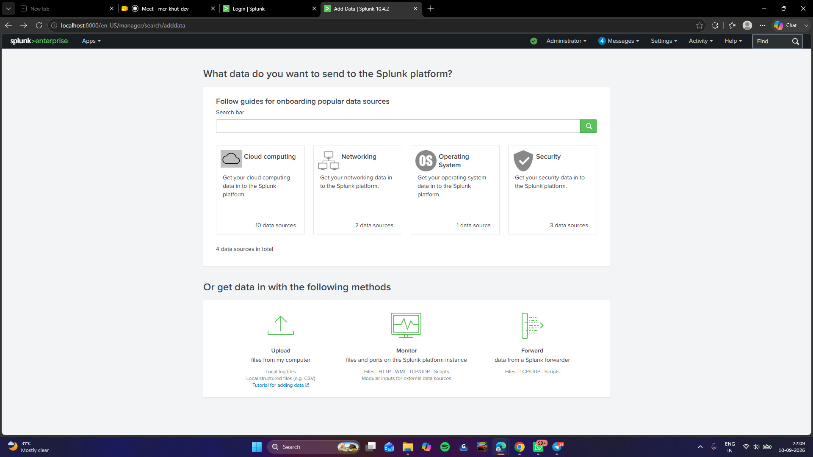

# 02 — Add Data
 
## Data Source
- **File:** `ssh_logs_new.json`
- **Format:** Zeek/Bro SSH connection logs, JSON
- **Host:** `Mahhyya`
- **Sourcetype:** `_json`
## Steps Taken
1. Created a dedicated index for this project: **Settings → Indexes → New Index** → named `ssh_logs` (kept separate from the default `main` index).
2. Uploaded the log file: **Settings → Add Data → Upload** → selected `ssh_logs_new.json`.
3. Set sourcetype to `_json` — Splunk auto-parses JSON keys into searchable fields, so no custom field extraction was needed.
4. Pointed the data to the `ssh_logs` index and completed onboarding.
5. Verified ingestion with a base search:
```spl
   source="ssh_logs_new.json" host="Mahhyya" sourcetype="_json"
```
6. Expanded a raw event and confirmed the following fields were correctly extracted:
| Field | Meaning |
|---|---|
| `id.orig_h` | Source IP (client/attacker) |
| `id.resp_h` | Destination IP (SSH server) |
| `id.orig_p` / `id.resp_p` | Source / destination port |
| `event_type` | Event category (e.g. "Failed SSH Login", "Successful SSH Login") |
| `auth_attempts` | Number of auth attempts in that connection |
| `auth_success` | true/false — login outcome |
| `username` | Username attempted |
| `conn_state` | Connection state (SF, S0, etc.) |
| `ts` | Event timestamp |
 
## Screenshots
 
**Add Data summary confirming source, sourcetype, and index**

 
**Expanded raw event showing extracted JSON fields**

